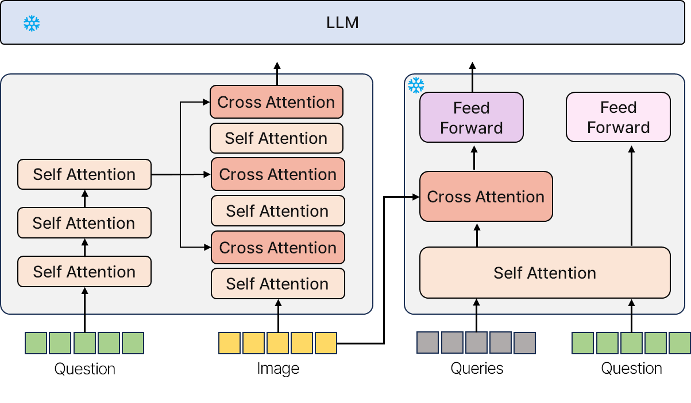
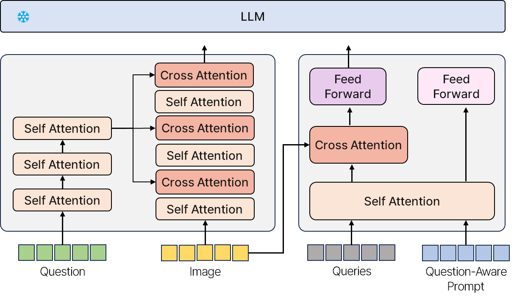

# Enhancing Q-Former for Visual Question Answering with Multi-layer Co-Attention and Question-Aware Prompts

We propose a model that enhances Q-Former’s performance by integrating the Modular Co-Attention Network (MCAN) and introducing a Question-Aware Prompt during fine-tuning to improve Visual Question Answering (VQA) tasks.

## Introduction

<details>
  <summary>Train & Eval</summary>
  
  ## Training & Inference
  
  ### Train
  After downloading the training datasets and specifying their path in [dataset configs](daiv/configs/datasets/), we are ready for training!
  
  #### 0. Setting Environments
  ```Shell
  conda create -n fusion python=3.9
  ```
  ```Shell
  git clone 
  ```
  ```Shell
  cd BLIVA
  ```
  ```Shell
  pip install -e .
  ```
  if packaging error occurs, then:
  ```Shell
  pip install setuptools==69.5.1
  ```

  ### Training
  
  #### 1. Pretraining of Dm-Former
  ```Shell
  python train.py --cfg-path train_configs/pretrain_stage1.yaml
  ```
  #### 2. Pretraining of visual assistant branch
  
  ```Shell
  python train.py --cfg-path train_configs/pretrain_stage2.yaml
  ```
  #### 3. Instruction Finetuning 
  ```Shell
  python train.py --cfg-path train_configs/finetune_stage2.yaml
  ```
  ### Evaluation
  
  #### Evaluation of Stage2 
  ```Shell
  python evaluate.py --cfg-path train_configs/pretrain_stage2_eval.yaml
  ```
  
  ```Shell
  python evaluate.py --cfg-path train_configs/finetune_stage2_eval.yaml
  ```
  
  #### Training with MCAN output (prophet) - okvqa
  ```Shell
  python train.py --cfg-path train_configs/finetune_stage2_t5_vqa.yaml
  ```
  ```Shell
  python evaluate.py --cfg-path train_configs/eval_stage2_vqa.yaml
  ```

</details>

**Visual Question Answering (VQA)** involves generating accurate answers by reasoning over both textual (questions) and visual (images) data. While **Q-Former** effectively uses Cross-Attention for learning question-image interactions, it struggles with modeling complex relationships due to its single-layer attention mechanism. 
To address these limitations, we propose a new architecture combining Q-Former with the **Modular Co-Attention Network (MCAN)**, a multi-layer attention mechanism that captures deeper and more complex interactions between questions and images. Additionally, we introduce **Question-Aware Prompts** during fine-tuning, providing richer contextual information to further enhance the model’s performance on VQA tasks.

## Methodology



The proposed model enhances **Q-Former**'s ability to model interactions between the question and the image by integrating **Modular Co-Attention Network (MCAN)** and leveraging **Question-Aware Prompts** during fine-tuning to refine reasoning for complex VQA tasks.

### Q-Former and MCAN Integration

In our architecture, **Q-Former** serves as the base model to process interactions between questions and images through its **Cross-Attention** mechanism. However, its single-layer structure has limitations in capturing more complex, nuanced relationships.

To address this, we integrated **MCAN**, a multi-layered network that employs both **Self-Attention** and **Cross-Attention** to progressively refine question-image interactions.

This integration enables the model to extract high-level semantic relationships while also capturing detailed information, which significantly improves the model’s overall reasoning capability.

### Fine-tuning with Question-Aware Prompts



During fine-tuning, we introduce **Question-Aware Prompts** to further enhance the model’s performance. These prompts provide additional context about the question, such as background knowledge and potential answer candidates. 

By incorporating these prompts, the model can better interpret the question's intent, allowing for deeper reasoning and more accurate answers. This approach is especially beneficial for complex questions, where the added context enables the model to generate more informed and precise responses. The combination of MCAN’s multi-layered attention mechanism and the use of Question-Aware Prompts during fine-tuning significantly improves the model’s ability to handle challenging VQA tasks.

## Results

We evaluated our model on standard VQA datasets such as **OK-VQA** and **AOK-VQA**, with pre-training performed on **COCO** and **Visual Genome** datasets. The following table presents the accuracy results comparing different models and the impact of incorporating **Question-Aware Prompts**.

| Model           | Accuracy (Only-Question) | Accuracy (Question-Aware Prompt) |
|-----------------|--------------------------|----------------------------------|
| Q-Former        | 49.2%                     | 55.65%                          |
| MCAN            | **52.56%**                | -                                |
| Ours            | 50%                       | **56.1%**                           |

### Results Analysis
The results demonstrate that integrating **MCAN** and utilizing **Question-Aware Prompts** significantly improves performance on VQA tasks. Our model achieved a **6.1% increase in accuracy** compared to the baseline (Q-Former with only questions). This improvement highlights the effectiveness of **Question-Aware Prompts**, which provide valuable context, helping the model better understand and reason about the question. Additionally, **MCAN**’s multi-layered attention mechanism outperforms the single-layer **Q-Former**, effectively capturing complex interactions between the question and image, and leading to more accurate answers.

In conclusion, the results validate that combining **MCAN**'s deeper attention mechanisms with **Question-Aware Prompts** leads to more sophisticated reasoning and higher accuracy, making our model better suited for tackling challenging VQA problems.
